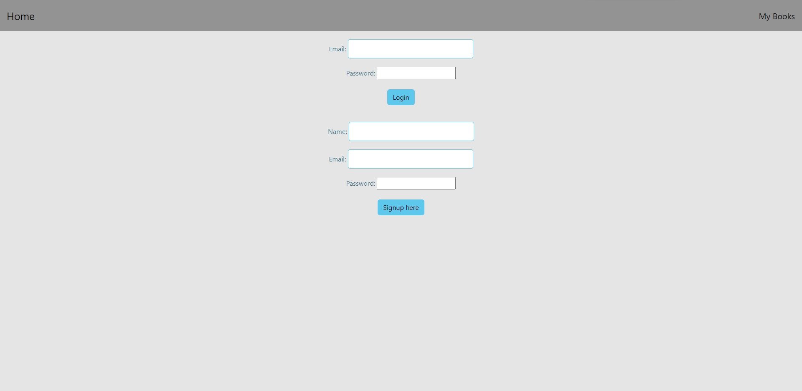
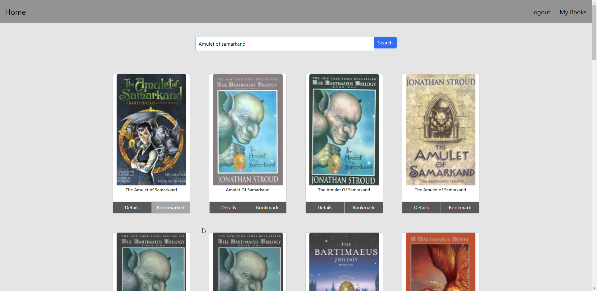

# BetterReads

## Table of Contents
- Description
- Usage
- Credits
- License
- Badges

## Decription
BetterReads allows users to make an account to keep up with their favorite authors and books associated, as well as bookmark read books.

## Usage!

## Credits
Work done by Andre Bessete, Shane Popowski, Gibson Berglund, Bredley Burnham, and Mohamed Farah.

TA assistance from Jessica Guico

## License

MIT License

Permission is hereby granted, free of charge, to any person obtaining a copy
of this software and associated documentation files (the "Software"), to deal
in the Software without restriction, including without limitation the rights
to use, copy, modify, merge, publish, distribute, sublicense, and/or sell
copies of the Software, and to permit persons to whom the Software is
furnished to do so, subject to the following conditions:

The above copyright notice and this permission notice shall be included in all
copies or substantial portions of the Software.

## Badge
